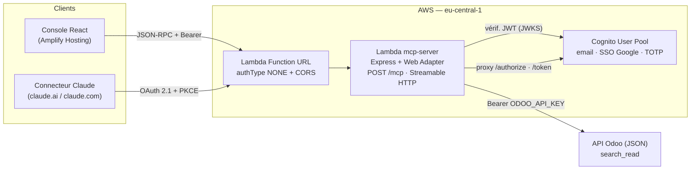

# Serveur MCP — Dattico

Serveur [MCP](https://modelcontextprotocol.io) sécurisé, déployé sur AWS avec Amplify Gen 2. Il expose les données Odoo (contacts, activités CRM, calendrier) à des clients MCP comme Claude, derrière une authentification Cognito (OAuth 2.1 + PKCE).

Le dépôt contient aussi une **console web React** permettant de se connecter, de parcourir le catalogue d'outils et de les tester en direct.

## Architecture



- La Lambda exécute une application **Express** derrière le *Lambda Web Adapter* ; la Function URL est publique, l'autorisation est faite **dans** la Lambda (`requireBearerAuth` + vérification du JWT Cognito).
- Le serveur MCP est **stateless** : une instance `McpServer` neuve à chaque requête, pas de session.
- La Lambda expose aussi une **façade OAuth 2.1** (`/.well-known/*`, `/authorize`, `/token`) qui proxifie Cognito — aucun token n'est stocké côté serveur.

## Stack

- **Frontend** — React 19, Create React App, `aws-amplify` 6, CSS custom (thème clair/sombre)
- **Backend** — AWS Amplify Gen 2 (CDK), Lambda Node.js 24 + AWS Lambda Web Adapter, Express 5
- **MCP** — `@modelcontextprotocol/sdk`, transport Streamable HTTP, schémas `zod`
- **Auth** — Cognito (email, SSO Google, MFA TOTP), OAuth 2.1 + PKCE, JWT vérifié avec `jose`
- **Données** — API JSON publique d'Odoo (`search_read`)

## Outils MCP exposés

| Outil | Rôle |
| --- | --- |
| `ping` | Test de disponibilité du serveur |
| `get-servers-registry` | Liste les serveurs MCP connus et leurs outils |
| `odoo-contact` | Recherche de contacts (`res.partner`) |
| `odoo-crm-activity-analysis` | Rapport d'activités CRM (`crm.activity.report`) |
| `odoo-calendar-events` | Événements du calendrier (`calendar.event`) |

Les trois outils Odoo acceptent `domain`, `fields` et `limit` optionnels ; les valeurs par défaut sont définies dans [index.ts](amplify/functions/mcp-server/src/index.ts). Le registre est également disponible comme ressource MCP `registry://servers`.

## Démarrage local

Prérequis : Node.js 20+, un profil AWS configuré, et **pas** de CLI Amplify Gen 1 installé (voir [GUIDE.md](GUIDE.md), étape 0).

```bash
npm install --legacy-peer-deps
```

Lancer le backend en sandbox (déploie Cognito, la Lambda MCP et génère `amplify_outputs.json`) :

```bash
npx ampx sandbox --profile <votre-profil>
```

Copier les outputs générés là où le frontend les lit :

```bash
cp amplify_outputs.json src/amplify_outputs.json
```

Démarrer la console web sur http://localhost:3000 :

```bash
npm start
```

> `amplify_outputs.json` est généré et ignoré par git. Il contient notamment `custom.mcpServerUrl` (l'URL de la Lambda MCP, utilisée par [src/awsConfig.js](src/awsConfig.js)) et `custom.claudeClientId`.

## Secrets

Trois secrets sont requis et doivent être définis via Amplify (jamais en clair dans le code) :

```bash
npx ampx sandbox secret set ODOO_API_KEY --profile <votre-profil>
```

| Secret | Usage |
| --- | --- |
| `ODOO_API_KEY` | Authentification auprès de l'API Odoo |
| `GOOGLE_CLIENT_ID` | SSO Google (Cognito) |
| `GOOGLE_CLIENT_SECRET` | SSO Google (Cognito) |

## Déploiement

Le déploiement est piloté par Amplify Hosting via [amplify.yml](amplify.yml), en deux pipelines :

- **backend** — installe et compile la Lambda MCP (`npm run build --prefix amplify/functions/mcp-server`) puis déploie le stack avec `ampx pipeline-deploy`.
- **frontend** — copie `amplify_outputs.json` dans `src/` et produit le build CRA dans `build/`.

## Structure du dépôt

```
amplify/
  auth/resource.ts              Cognito (email, Google, TOTP)
  data/resource.ts              modèle de données (démo)
  backend.ts                    assemblage, Function URL, variables d'env
  functions/mcp-server/
    resource.ts                 définition de la Lambda (runtime, layer, bundling)
    run.sh                      point d'entrée du Web Adapter
    src/index.ts                app Express, outils et ressources MCP
    src/auth.ts                 vérification des tokens Cognito
    src/oauth.ts                façade OAuth 2.1 / proxy Cognito
    src/odoo.ts                 appels search_read + résolution des secrets
    src/registry.ts             registre des serveurs MCP
    src/config.ts               configuration runtime
src/
  mcp.js                        client JSON-RPC vers /mcp
  awsConfig.js                  configuration Amplify + URL du serveur
  components/                   Catalogue, TestConsole, Security, Login
amplify.yml                     pipelines Amplify Hosting
GUIDE.md                        guide de construction pas-à-pas
```

## Pour aller plus loin

[GUIDE.md](GUIDE.md) reprend l'intégralité du projet étape par étape (création du backend, compilation du serveur MCP, SSO Google et MFA TOTP, sécurisation OAuth de l'endpoint, configuration validée du connecteur Claude, limites connues et dépannage).
